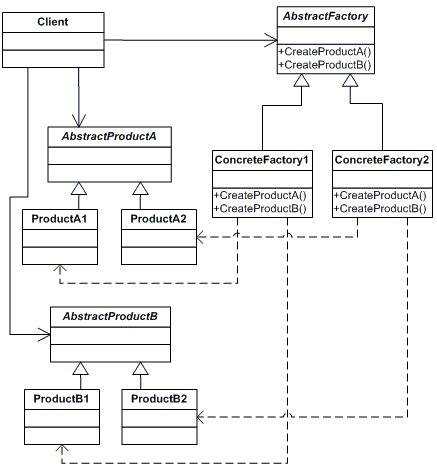
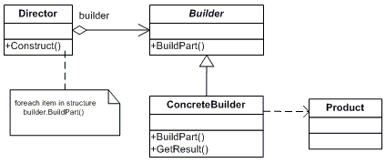
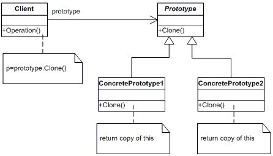

# The Abstract Factory
an interface for creating families of related or dependent objects without specifying their concrete classes

## Participants
**AbstractFactory**  (ContinentFactory)
declares an interface for operations that create abstract products

**ConcreteFactory**   (AfricaFactory, AmericaFactory)
implements the operations to create concrete product objects

**AbstractProduct**   (Herbivore, Carnivore)
declares an interface for a type of product object

**Product**  (Wildebeest, Lion, Bison, Wolf)
defines a product object to be created by the corresponding concrete factory
implements the AbstractProduct interface

**Client**  (AnimalWorld)
uses interfaces declared by AbstractFactory and AbstractProduct classes

# Builder
separates the construction of a complex object from its representation so that the same construction process can create different representations

## Participants

**Builder**  (VehicleBuilder)
specifies an abstract interface for creating parts of a Product object

**ConcreteBuilder**  (MotorCycleBuilder, CarBuilder, ScooterBuilder)
- constructs and assembles parts of the product by implementing the Builder interface
- defines and keeps track of the representation it creates
- provides an interface for retrieving the product

**Director**  (Shop)
constructs an object using the Builder interface

**Product**  (Vehicle)
- represents the complex object under construction. ConcreteBuilder builds the product's internal representation and defines the process by which it's assembled
- includes classes that define the constituent parts, including interfaces for assembling the parts into the final result

# Factory Method
defines an interface for creating an object, but let subclasses decide which class to instantiate. This pattern lets a class defer instantiation to subclasses

## Participants

**Product**  (Page)
defines the interface of objects the factory method creates

**ConcreteProduct**  (SkillsPage, EducationPage, ExperiencePage)
implements the Product interface

**Creator**  (Document)
declares the factory method, which returns an object of type Product. Creator may also define a default implementation of the factory method that returns a default ConcreteProduct object.
may call the factory method to create a Product object.

**ConcreteCreator**  (Report, Resume)
overrides the factory method to return an instance of a ConcreteProduct.

# Prototype
specifies the kind of objects to create using a prototypical instance, and create new objects by copying this prototype

## Participants

**Prototype**  (ColorPrototype)
declares an interface for cloning itself

**ConcretePrototype**  (Color)
implements an operation for cloning itself

**Client**  (ColorManager)
creates a new object by asking a prototype to clone itself

# Singleton
ensures a class has only one instance and provide a global point of access to it

## Participants

**Singleton**   (LoadBalancer)
defines an Instance operation that lets clients access its unique instance. Instance is a class operation.
responsible for creating and maintaining its own unique instance.